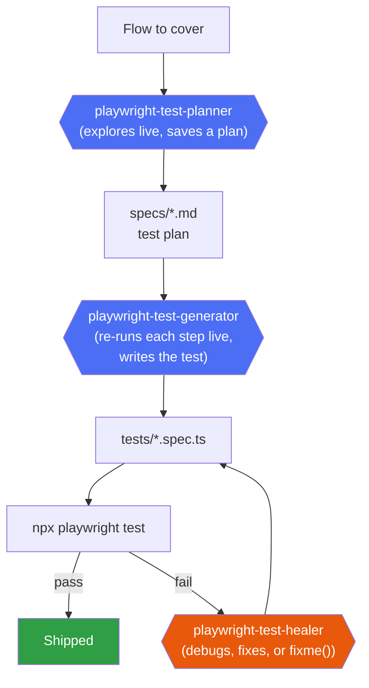
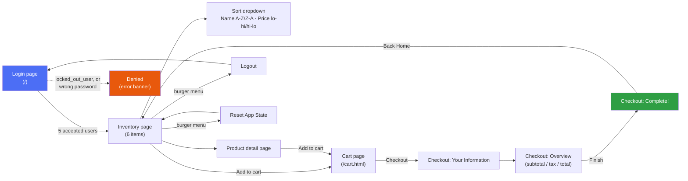

# PromtDrivenAutomation_JavaScript

Prompt-driven test automation, JS/TS sibling to the C#/NUnit `PromtDrivenAutomation` repo — but
built around Playwright's **official** Planner/Generator/Healer agents
(`npx playwright init-agents --loop claude`) instead of hand-written Claude Code subagents. That
official tooling only exists for `@playwright/test` (JS/TS), which is the whole reason this
sibling repo exists: to actually use it, rather than reimplement it for a stack it doesn't support.

App under test: [SauceDemo](https://www.saucedemo.com/) (`baseURL` in `playwright.config.js`) —
same app as the C# repo, for easy side-by-side comparison of the two approaches.

## How it works



All three agents talk to a **dedicated** MCP server (`playwright-test`, wired in `.mcp.json`,
started via `npx playwright run-test-mcp-server`) that exposes purpose-built tools -
`planner_save_plan`, `generator_write_test`, `test_debug`, `test_run`, etc. - distinct from the
general-purpose `@playwright/mcp` browser-automation server used for ad hoc exploration.

**Important:** these are Microsoft's own, unmodified agent prompts (`.claude/agents/playwright-
test-*.md`) - installed as-is on purpose, not edited to match this repo's conventions. One
consequence: the Generator's own instructions hard-code `.spec.ts` output with TypeScript syntax,
even though this project's own tooling (`package.json`, config) is plain JavaScript/Node. That's
fine - Playwright Test transpiles `.ts` files natively, no build step needed - but it means
generated test files will be TypeScript regardless of this being a "JavaScript" project. Keeping
the agents stock was a deliberate choice over forking Microsoft's prompts to force `.js` output.

## Setup
```powershell
cd C:\PromtDrivenAutomation_JavaScript
npm install
npx playwright install chromium
```

## Daily workflow
1. **Before planning new functionality, check `specs/manifest.json`** (see
   [Finding where new tests belong](#finding-where-new-tests-belong) below) to see whether an
   existing plan already covers the feature area, so new scenarios extend it instead of
   duplicating it under a new plan.
2. **Plan a flow**: `Use the playwright-test-planner agent to plan <flow description>`. It
   explores the live app and saves a test plan to `specs/<name>.md`.
3. **Generate tests from the plan**: `Use the playwright-test-generator agent to generate tests
   for <scenario> from specs/<name>.md`. It re-executes every step live to verify it, then writes
   one `tests/<name>.spec.ts` per scenario.
4. **Run**: `npm test` (or `npm run test:ui` for interactive mode, `npm run test:report` to open
   the last HTML report). `npm test` always regenerates `specs/manifest.json` first via its
   `pretest` hook, so it's never stale.
5. **If something fails later** (app changed): `Use the playwright-test-healer agent to fix the
   failing tests`. It runs the suite, debugs each failure live, fixes code, and marks
   `test.fixme()` with an explanatory comment instead of guessing if it can't resolve something
   confidently.

## Finding where new tests belong

With two plans and 24 tests this is easy to hold in your head. It won't be at 100+ tests, so
`specs/manifest.json` exists to answer "does something already cover this?" without relying on
memory of past sessions.

**It's generated, not hand-maintained** — `scripts/generate-test-index.js` runs
`playwright test --list --reporter=json` to enumerate every file/suite/test, then reads each
file's `// spec:` / `// seed:` header comment to link it back to the plan that produced it. It
can't drift from reality because it's derived from the actual test files every time it runs
(`npm run test:index`, or automatically via `pretest` before every `npm test`).

```json
{
  "totals": { "files": 11, "tests": 24, "plans": 3 },
  "byPlan": {
    "specs/shopping-flow.plan.md": ["tests/cart/cart-page.spec.ts", "..."],
    "specs/login-and-inventory.plan.md": ["tests/login/login-accepted-users.spec.ts", "..."]
  },
  "files": [
    {
      "file": "tests/cart/cart-page.spec.ts",
      "specPlan": "specs/shopping-flow.plan.md",
      "suites": [{ "suite": "Cart Page", "tests": ["..."], "count": 2 }]
    }
  ]
}
```

**The decision this drives**, before invoking the Planner for new functionality:
- Grep `byPlan` / `files[].file` for the feature area or URL the new functionality touches.
- **Match found** → tell the Planner it's extending `specs/<that-plan>.md`, point the Generator
  at the existing `file` for that suite, and have it add new scenarios rather than duplicate
  existing ones.
- **No match** → it's a new feature area; a new plan file is fine.

This only works if every generated test actually carries an accurate `// spec:` header — the
stock Generator agent's own example prompt uses the literal placeholder `specs/plan.md`, and
several early tests in this repo were generated with that placeholder left unfilled. Those were
corrected by hand; going forward, generator invocations should explicitly state the real plan
path to use in the header rather than relying on the agent to infer it.

## Test coverage

Two plans, generated so far, cover the whole positive-path shopping journey plus the login
negative cases:



| Plan | Spec files | Scenarios |
|---|---|---|
| `specs/login-and-inventory.plan.md` | `login-accepted-users.spec.ts` | 5 — one per accepted username (`standard_user`, `problem_user`, `performance_glitch_user`, `error_user`, `visual_user`) |
| | `login-negative.spec.ts` | 2 — `locked_out_user` denied despite the correct password; valid username + wrong password denied |
| | `inventory-items.spec.ts` | 1 — exactly 6 items, each with name/price/own Add to cart button |
| `specs/shopping-flow.plan.md` | `cart-inventory-add-remove.spec.ts` | 3 — add/remove from the inventory page, badge count tracks correctly |
| | `cart-page.spec.ts` | 2 — cart page lists the right items; removing from the cart page itself works |
| | `checkout-flow.spec.ts` | 2 — full 3-step checkout, single item and multi-item price totals |
| | `product-sort.spec.ts` | 4 — all four sort modes, including price tie-breaking |
| | `product-detail.spec.ts` | 2 — navigating in via name/image, adding to cart from the detail page |
| | `logout.spec.ts` | 1 — logout clears the session (direct nav back to `/inventory.html` redirects to `/`) |
| | `reset-app-state.spec.ts` | 1 — clears the cart; inventory buttons need a reload to visually revert (a confirmed quirk) |

24 tests total (23 generated + the seed), all green on `npm test`.

### Visual example: a generated test

This is `tests/cart/cart-inventory-add-remove.spec.ts`'s first test, as written by the Generator
agent — note it re-performs the seed's login inline (every spec file is standalone; Playwright
doesn't share browser state across files just because a comment points at a seed):

```ts
test('Adding a single item updates the cart badge and button', async ({ page }) => {
  await page.goto('/');
  await page.locator('[data-test="username"]').fill('standard_user');
  await page.locator('[data-test="password"]').fill('secret_sauce');
  await page.locator('[data-test="login-button"]').click();

  const cartLink = page.locator('[data-test="shopping-cart-link"]');
  const cartBadge = page.locator('[data-test="shopping-cart-badge"]');

  // The badge element doesn't exist in the DOM at all when the cart is empty
  await expect(cartLink).toHaveAccessibleName('Cart, empty');
  await expect(cartBadge).toHaveCount(0);

  await page.locator('[data-test="add-to-cart-sauce-labs-backpack"]').click();

  await expect(page.locator('[data-test="remove-sauce-labs-backpack"]')).toHaveText('Remove');
  await expect(cartBadge).toHaveText('1');
  await expect(cartLink).toHaveAccessibleName('Cart, 1 items');
});
```

And from `tests/inventory/inventory-items.spec.ts`, a locator trap known from the sibling C# repo:
all 6 "Add to cart" buttons share the same accessible name, so an unscoped
`page.getByRole('button', { name: 'Add to cart' })` throws a strict-mode violation. The Planner
flagged this ahead of time, so the Generator scoped the locator per item container instead:

```ts
const items = page.locator('.inventory_item');
await expect(items).toHaveCount(6);

for (let i = 0; i < await items.count(); i++) {
  const item = items.nth(i);
  const addToCartButton = item.getByRole('button', { name: 'Add to cart' }); // scoped, not page.getByRole(...)
  await expect(addToCartButton).toHaveCount(1);
}
```

## Structure
| Path | Purpose |
|---|---|
| `specs/` | Test plans, written by the Planner agent as plain markdown |
| `specs/manifest.json` (generated) | Index of every test file/suite/test and which plan produced it — see [Finding where new tests belong](#finding-where-new-tests-belong) |
| `scripts/generate-test-index.js` | Regenerates `specs/manifest.json` from `playwright test --list`; run via `npm run test:index` or automatically before `npm test` |
| `tests/seed.spec.ts` | Shared starting state (logs in as `standard_user`) the Planner/Generator use as their environment seed |
| `tests/*.spec.ts` | Generated tests, one scenario per file, written by the Generator agent |
| `.claude/agents/playwright-test-*.md` | Microsoft's official agent definitions, installed via `init-agents`, unmodified |
| `.mcp.json` | Wires up the dedicated `playwright-test` MCP server these agents use |
| `playwright.config.js` | Base URL, browser projects, reporter |
| `playwright-report/` (git-ignored) | HTML report from the last run |

## Status

The three agents are installed, the seed test (login as `standard_user`) is verified working, and
the Planner/Generator have since produced full coverage of login, inventory, cart, checkout,
sorting, product detail, logout, and reset-app-state — see [Test coverage](#test-coverage) above.
