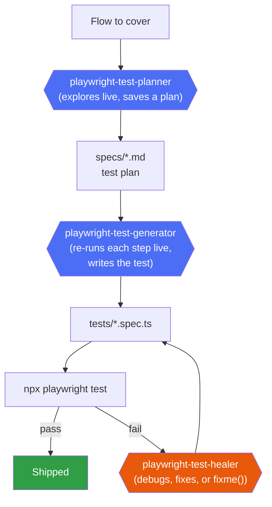

# PromtDrivenAutomation_JavaScript

Prompt-driven test automation, JS/TS sibling to the C#/NUnit `PromtDrivenAutomation` repo — but
built around Playwright's **official** Planner/Generator/Healer agents
(`npx playwright init-agents --loop claude`) instead of hand-written Claude Code subagents. That
official tooling only exists for `@playwright/test` (JS/TS), which is the whole reason this
sibling repo exists: to actually use it, rather than reimplement it for a stack it doesn't support.

App under test: [SauceDemo](https://www.saucedemo.com/) (`baseURL` in `playwright.config.js`) —
same app as the C# repo, for easy side-by-side comparison of the two approaches.

## How it works



All three agents talk to a **dedicated** MCP server (`playwright-test`, wired in `.mcp.json`,
started via `npx playwright run-test-mcp-server`) that exposes purpose-built tools -
`planner_save_plan`, `generator_write_test`, `test_debug`, `test_run`, etc. - distinct from the
general-purpose `@playwright/mcp` browser-automation server used for ad hoc exploration.

**Important:** these are Microsoft's own, unmodified agent prompts (`.claude/agents/playwright-
test-*.md`) - installed as-is on purpose, not edited to match this repo's conventions. One
consequence: the Generator's own instructions hard-code `.spec.ts` output with TypeScript syntax,
even though this project's own tooling (`package.json`, config) is plain JavaScript/Node. That's
fine - Playwright Test transpiles `.ts` files natively, no build step needed - but it means
generated test files will be TypeScript regardless of this being a "JavaScript" project. Keeping
the agents stock was a deliberate choice over forking Microsoft's prompts to force `.js` output.

## Setup
```powershell
cd C:\PromtDrivenAutomation_JavaScript
npm install
npx playwright install chromium
```

## Daily workflow
1. **Plan a flow**: `Use the playwright-test-planner agent to plan <flow description>`. It
   explores the live app and saves a test plan to `specs/<name>.md`.
2. **Generate tests from the plan**: `Use the playwright-test-generator agent to generate tests
   for <scenario> from specs/<name>.md`. It re-executes every step live to verify it, then writes
   one `tests/<name>.spec.ts` per scenario.
3. **Run**: `npm test` (or `npm run test:ui` for interactive mode, `npm run test:report` to open
   the last HTML report).
4. **If something fails later** (app changed): `Use the playwright-test-healer agent to fix the
   failing tests`. It runs the suite, debugs each failure live, fixes code, and marks
   `test.fixme()` with an explanatory comment instead of guessing if it can't resolve something
   confidently.

## Structure
| Path | Purpose |
|---|---|
| `specs/` | Test plans, written by the Planner agent as plain markdown |
| `tests/seed.spec.ts` | Shared starting state (logs in as `standard_user`) the Planner/Generator use as their environment seed |
| `tests/*.spec.ts` | Generated tests, one scenario per file, written by the Generator agent |
| `.claude/agents/playwright-test-*.md` | Microsoft's official agent definitions, installed via `init-agents`, unmodified |
| `.mcp.json` | Wires up the dedicated `playwright-test` MCP server these agents use |
| `playwright.config.js` | Base URL, browser projects, reporter |
| `playwright-report/` (git-ignored) | HTML report from the last run |

## How this differs from the C# solution
- Uses Playwright's **official** agents (Microsoft-authored), not custom Claude Code subagents -
  the C# repo had to build its own planner/generator/healer because that official tooling doesn't
  exist for .NET/NUnit.
- Those official agents use a dedicated `playwright-test` MCP server with purpose-built tools,
  rather than driving the general-purpose `@playwright/mcp` browser server directly.
- No custom spec schema, linter, or staleness-check yet - `specs/*.md` is just whatever shape the
  Planner produces, not a hand-designed multi-scenario frontmatter format like the C# repo's.
  `generation-manifest.json`-style spec-to-code tracking doesn't exist here either - add it later
  if drift-detection turns out to matter as much here as it did on the C# side.
- Generated tests are TypeScript, by Playwright's own convention (see above) - the C# repo has no
  equivalent language mismatch since everything there is C#.

This is a day-1 scaffold: the three agents are installed and the seed test (login as
`standard_user`) is verified working. No scenario coverage has been generated yet.
