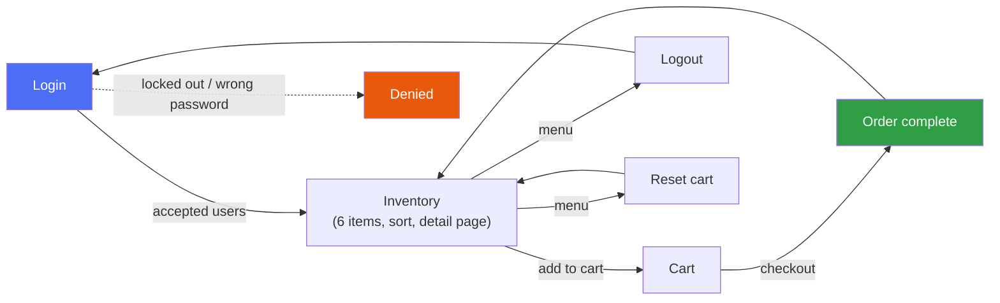

# PromtDrivenAutomation_JavaScript

[](https://github.com/nitesh00747/PromtDrivenAutomation_JavaScript/actions/workflows/playwright.yml)
[](https://playwright.dev)
[](https://www.typescriptlang.org/)
[](https://nodejs.org/)

This is a reusable pattern for testing *any* web application: instead of writing Playwright tests
by hand, you describe a flow in plain English, and three AI agents plan it, write it, and fix it
automatically if it ever breaks. Nothing about the agents themselves is specific to one app — this
repo just demonstrates the pattern against [SauceDemo](https://www.saucedemo.com/) as a working
example. Point it at your own application and the same workflow applies.

(This is the JS/TS sibling to the C#/NUnit `PromtDrivenAutomation` repo, built on Playwright's own
official agents rather than custom-written ones.)

## How it works

Three agents, each with one job:

- **Planner** — explores the live app and writes a plain-English test plan.
- **Generator** — reads that plan, replays every step in a real browser to confirm it works, then writes the actual Playwright test.
- **Healer** — if a test later fails (the app changed, a selector broke), it debugs and fixes it automatically.

You drive all three from the terminal with plain instructions — no code to write yourself.

## Getting started

```powershell
cd C:\PromtDrivenAutomation_JavaScript
npm install
npx playwright install chromium
```

## How to use this solution

1. **Describe a flow you want covered.** Ask the Planner agent in plain English, e.g. "Use the
   playwright-test-planner agent to plan the checkout flow." It explores the app itself and saves
   a test plan under `specs/`.
2. **Turn the plan into tests.** Ask the Generator agent to generate tests from that plan. It
   re-runs every step live to make sure it actually works, then writes the test file under `tests/`.
3. **Run the suite.** `npm test` runs everything (`npm run test:ui` for an interactive view,
   `npm run test:report` to open the last HTML report).
4. **If a test breaks later,** ask the Healer agent to fix it. It runs the suite, figures out why
   each failure happened, and either fixes the test or marks it with a clear explanation if it
   can't.

Before asking the Planner to cover something new, it's worth checking whether an existing plan
already covers that area of the app — see [Avoiding duplicate coverage](#avoiding-duplicate-coverage)
below.

## Using this on your own application

The whole point of using Playwright's official agents is that none of the above is tied to
SauceDemo. To point this at a different app:

1. Change `baseURL` in `playwright.config.js` to your app's URL.
2. Replace `tests/seed.spec.ts` with whatever "starting state" makes sense for your app (often
   just logging in).
3. Follow the same four steps above — plan, generate, run, heal — describing *your* app's flows
   instead of SauceDemo's.

Everything else (the agents, the manifest script, the workflow) carries over unchanged.

## What's covered today

Two plans exist so far, covering the full positive-path shopping journey plus login's negative
cases:



| Area | Plan | What's tested |
|---|---|---|
| Login | `specs/login-and-inventory.plan.md` | Every accepted username, the locked-out user denial, a wrong-password denial |
| Inventory listing | `specs/login-and-inventory.plan.md` | All 6 items show a name, price, and working Add to cart button |
| Cart | `specs/shopping-flow.plan.md` | Adding/removing items, badge count, the cart page itself |
| Checkout | `specs/shopping-flow.plan.md` | The full 3-step checkout, including price totals |
| Sorting | `specs/shopping-flow.plan.md` | All four sort options |
| Product detail page | `specs/shopping-flow.plan.md` | Viewing and adding to cart from a single product's page |
| Logout & reset | `specs/shopping-flow.plan.md` | Logging out clears the session; resetting clears the cart |

24 tests total, all passing.

## Avoiding duplicate coverage

At 24 tests it's easy to remember what's already covered. It won't be once this grows past 100,
so `specs/manifest.json` keeps an always-current index of every test and which plan produced it —
regenerated automatically before every `npm test` run (or on demand via `npm run test:index`), so
it never goes stale.

Before asking the Planner to cover something new, check that file for the feature area or page
you're about to describe. If it's already there, point the new work at extending that existing
plan instead of starting a new one; if not, a fresh plan is the right call.

## Project layout

| Path | Purpose |
|---|---|
| `specs/` | Test plans, written by the Planner as plain markdown |
| `specs/manifest.json` | Auto-generated index of all tests — see above |
| `tests/` | Generated tests, written by the Generator, one file per scenario |
| `tests/seed.spec.ts` | The starting point (logs in) that other scenarios build on |
| `.claude/agents/` | The three agents' official, unmodified definitions |
| `playwright.config.js` | Base URL, browser settings, reporter |

## Status

All three agents are installed and working. Login, inventory, cart, checkout, sorting, product
detail, logout, and cart-reset all have passing test coverage.
